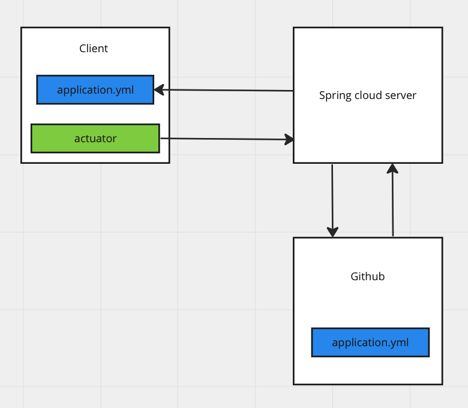

# spring-cloud-actuator

## Обновление конфигураций без перезагрузки приложения

1) Конфигурации хранятся на github
2) Актуатор с какой-то периодичностью делает запрос **/actuator/refresh** на spring cloud server для проверки изменений в конфигурациях на github
3) Когда конфигурации изменяться, актуатор обновит конфигурации в приложении помеченные @ConfigurationProperties и @RefreshScope без перезагрузки приложения

